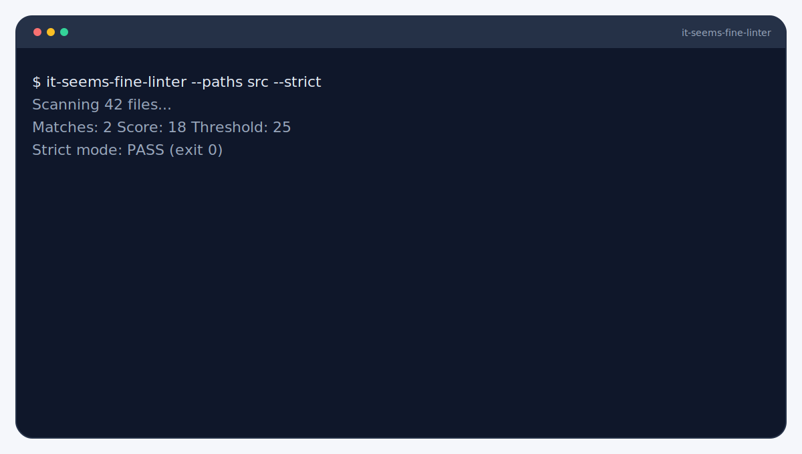

<picture>
  <source srcset="branding/hero.svg" type="image/svg+xml">
  
</picture>

# it-seems-fine-linter
Detect vibes-based engineering and score the risk. Turns vague language into a measurable risk score for CI.

   

> [!IMPORTANT]
> Run this on trusted branches only. Strict mode can fail CI when the score crosses your threshold.

## Quickstart
```bash
npx it-seems-fine-linter --paths src
```

## Demo


```bash
it-seems-fine-linter --paths src --strict
```

## Docs
Start here: [Requirements](#requirements) · [Install](#install) · [Usage](#usage) · [Configuration](#configuration) · [Exit Codes](#exit-codes) · [Troubleshooting](#troubleshooting)

## Contributing
See `CONTRIBUTING.md`.

## Requirements

- Node.js 20+

## Install

```bash
npm install -D it-seems-fine-linter
```

## Usage

```bash
it-seems-fine-linter --paths src
it-seems-fine-linter --paths src,docs --strict --threshold 30
it-seems-fine-linter --config phrases.json --json
```

**Options**

- `--paths <globs>` Comma-separated paths or glob patterns. Directories expand to `**/*`. Default: `.`.
- `--config <file>` JSON config with `phrases` and optional `threshold`.
- `--strict` Exit `2` when score >= threshold.
- `--threshold <n>` Score threshold (default `25`). CLI flag overrides config.
- `--json` Emit machine-readable JSON.

## Why This Exists

Turn vague phrases into measurable signal before merging.

## Configuration

```json
{
  "threshold": 30,
  "phrases": [
    { "phrase": "should be fine", "severity": 2 },
    { "phrase": "ship it", "severity": 3 }
  ]
}
```

## JSON Output

```json
{
  "score": 18,
  "threshold": 25,
  "strict": false,
  "matchCount": 2,
  "matches": [
    { "location": "src/app.ts", "phrase": "ship it", "severity": 3 }
  ]
}
```

## Exit Codes

- `0` Success
- `1` Runtime/config error or no files matched
- `2` Strict mode threshold exceeded

## Troubleshooting

- **No files matched**: Ensure `--paths` points to existing directories or valid glob patterns.
- **Config not found**: Pass an absolute or repo-relative path to `--config`.
- **Config JSON error**: Validate JSON format and ensure `threshold`/`severity` are numbers.
- **No matches**: Remember it scans comments and PR metadata; text in code strings won't match unless in comments.
- **CI mismatch**: Ensure `GITHUB_EVENT_PATH` exists if relying on PR title/body scanning.

## FAQ

- **Custom phrases?** Yes via `--config`.
- **CI friendly?** Yes with strict mode.

## License

MIT

